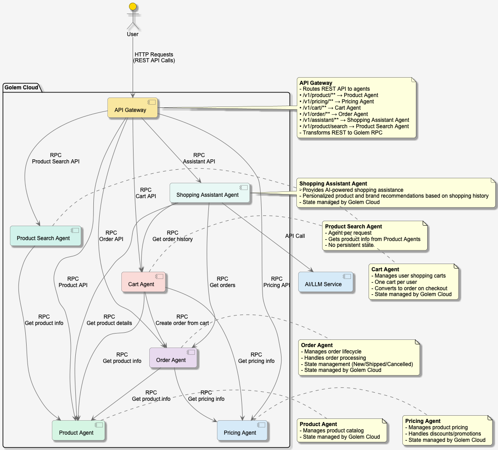

# Building a Distributed Shopping Application with Rust and Golem: An Agent-Native Architecture

## Introduction

In today's cloud-native world, developers are constantly seeking more efficient and scalable ways to build applications. The Golem Shopping project demonstrates how to build a distributed shopping application using Rust and the [Golem Cloud](https://golem.cloud/), showcasing the power of WebAssembly (Wasm) and agent-native architectures.

## Project Overview

Golem Shopping is a modular e-commerce application composed of four main components:

1. **Product Agent**: Manages product information
2. **Pricing Agent**: Handles product pricing
3. **Cart Agent**: Manages user shopping carts
4. **Order Agent**: Processes and tracks orders
5. **Product Search Agent**: Handles product search functionality
6. **Shopping Assistant Agent**: AI-powered assistant for personalized shopping experiences

## Technical Architecture

### Built with Rust and WebAssembly

The entire application is written in Rust and compiled to WebAssembly, offering near-native performance with the safety guarantees of Rust's ownership model. Each component is deployed as an independent Golem agent, communicating through well-defined interfaces.

### Key Technologies

- **Rust**: For type-safe, performant code
- **WebAssembly (Wasm)**: For portable, secure execution
- **Golem Cloud**: For distributed computation

### Architecture Overview

The following diagram illustrates the high-level architecture of the Golem Shopping application:



*Figure 1: Golem Shopping Application Architecture*

To view or edit this diagram, see the `architecture.puml` file in the project root. The diagram can be rendered using any PlantUML-compatible tool.

### Communication Flow

1. Users interact with the system through the API Gateway
2. The gateway routes requests to the appropriate agents
3. Agents communicate via RPC calls as needed
4. External AI/LLM service enhance the Shopping Assistant's capabilities

## Component Design

### 1. Product Agent

The Product Agent serves as the authoritative source for product information. By assigning a dedicated agent to each product, the system achieves fine-grained isolation and scalability. This actor-based approach allows individual products to be updated largely independently, ensuring that high-traffic items don't impact the performance of the rest of the catalog.

### 2. Pricing Agent

Complementing the product catalog, the Pricing Agent encapsulates all pricing logic. Separating pricing from product data allows for dynamic strategies—such as discounts, flash sales, or personalized offers—to be deployed without modifying the core product definitions. This separation of concerns enables the business to iterate on pricing models rapidly with zero downtime.

### 3. Cart Agent

The Cart Agent anchors the user's shopping experience by providing a persistent, individual shopping cart. Maintained as a stateful entity for every user, it handles the addition and removal of items while performing real-time price validation. When a user is ready to buy, the Cart Agent seamlessly hands off the session data to the Order Agent, ensuring a smooth transition from browsing to purchasing.

### 4. Product Search Agent

Unlike its stateful counterparts, the Product Search Agent is designed for high throughput and stateless operation. It acts as an intelligent router, querying multiple product agents to aggregate results for user searches. Because it maintains no persistent state of its own, it can be scaled horizontally with ease to handle spikes in search traffic.

### 5. Order Agent

Once a purchase is committed, the Order Agent takes over to manage the lifecycle of the transaction. It acts as the guardian of order integrity, enforcing valid state transitions from creation to fulfillment. By strictly managing states—such as 'New', 'Shipped', or 'Cancelled'—it ensures that orders become immutable once fulfilled, preserving a reliable audit trail of the business's history.

### 6. Shopping Assistant Agent

Finally, the Shopping Assistant bridges the gap between deterministic business logic and probabilistic AI. By integrating with Large Language Models, it offers users a conversational interface to the store. It is context-aware, accessing user history and active cart data to act as a personalized digital concierge, relying on Golem Cloud to reliably manage the conversation state.

## Key Features

### 1. Snapshot-Based Updates

The application implements Golem's snapshot-based update mechanism, allowing for:

- Zero-downtime deployments
- Stateful updates
- Rollback capabilities

### 2. Agent-to-Agent Communication

The Product Search Agent demonstrates efficient service decomposition by:
- Delegating data storage to the Product Agent
- Focusing solely on search request routing and response aggregation
- Enabling independent scaling of search functionality

Components communicate using Golem's RPC mechanism, enabling:

- Loose coupling between agents
- Location transparency

### 3. REST API Gateway

The application exposes REST APIs through Golem's API gateway, providing:

- Standard HTTP interfaces
- Easy integration with web and mobile clients

## Getting Started

### Prerequisites

- Rust toolchain
- Golem CLI
- Docker (for local development)

### Building and Deploying

```bash
# Build all components
golem-cli build

# Deploy to Golem
golem-cli deploy
```

### Interacting with the Services

```bash
golem-cli repl
```

## Performance Benchmarks

To ensure the Golem Shopping application meets production-grade performance requirements, we've conducted extensive load testing using the Goose load testing framework. These benchmarks demonstrate the system's ability to handle real-world e-commerce traffic patterns.

### Test Environment

- **Hardware**: Local development environment (MacBook Pro 2019, 2,4 GHz 8-Core Intel Core i9, 32 GB RAM) with Golem [running locally in Docker](https://github.com/golemcloud/golem/tree/main/docker-examples/published-postgres)
- **Concurrent Users**: 16 virtual users
- **Test Duration**: Approximately 3 minutes
- **Test Scenarios**:
  1. **Product Lookup**: Retrieve product details
  2. **Pricing Lookup**: Fetch product pricing
  3. **Product Search By Brand**: Perform product searches
  4. **Cart Operations**: Complete cart workflow including:
     - Adding items to cart
     - Removing items
     - Setting email
     - Setting billing address
     - Checking out
     - Retrieving order details

### Key Performance Metrics

| Operation                           | Average Response Time | Requests per Second |
|-------------------------------------|-----------------------|---------------------|
| Get Product                         | 70ms               | 0.40 RPS            |
| Get Pricing                         | 45ms               | 0.38 RPS            |
| Product Search By Brand             | 3200ms             | 0.30 RPS            |
| Create, checkout Cart and get Order | 170ms              | 0.33 RPS            |

### Test Data

- **Products**: 50 unique products (IDs: p001-p050)
- **Users**: 10 unique user sessions (user001-user010)
- **Cart Items**: 4 items per cart on average

### Performance Characteristics

1. **Consistent Latency**: The system maintains sub-100ms response times for core read operations (Product, Pricing) even under load.
2. **High Throughput**: The application handles approximately 4.4 requests per second across all endpoints in this local configuration.
3. **Reliability**: 100% success rate across all test scenarios, demonstrating the system's stability.
4. **Scalability**: The agent-based architecture allows horizontal scaling of individual components based on demand.

### Benchmark Execution

Benchmarks can be reproduced using the following commands:

```bash
# Set environment variables
export HOST=http://localhost:9006
export API_HOST=http://localhost:9006

# Run benchmarks
cargo run --release -- --report-file=report.html --no-reset-metrics
```

see [benchmarks/README.md](https://github.com/justcoon/golem-shopping/blob/main/benchmarks/README.md) for more details

## Benefits of This Architecture

1. **Scalability**: Each component scales independently based on demand
2. **Resilience**: Isolated failures don't bring down the entire system
3. **Developer Experience**: Clear boundaries between agents
4. **Cost Efficiency**: Pay only for the compute you use

## Real-World Applications

The patterns demonstrated in this project can be applied to:

- Agent-based architectures
- Microservices architectures
- Agent-native applications
- Distributed systems
- E-commerce platforms

## Conclusion

The Golem Shopping project showcases how modern web technologies like Rust, WebAssembly, and the Golem Cloud can be combined to build scalable, maintainable distributed applications. By leveraging these technologies, developers can create systems that are both performant and easy to reason about.

## Next Steps

1. Explore the [GitHub repository](https://github.com/justcoon/golem-shopping-rust)
2. Try deploying your own instance
3. Contribute to the project
4. Check out the [TypeScript implementation](https://github.com/justcoon/golem-shopping-ts) for a similar application built with TypeScript

## Resources

- [Golem Documentation](https://learn.golem.cloud/)
- [Rust Programming Language](https://www.rust-lang.org/)
- [WebAssembly](https://webassembly.org/)
